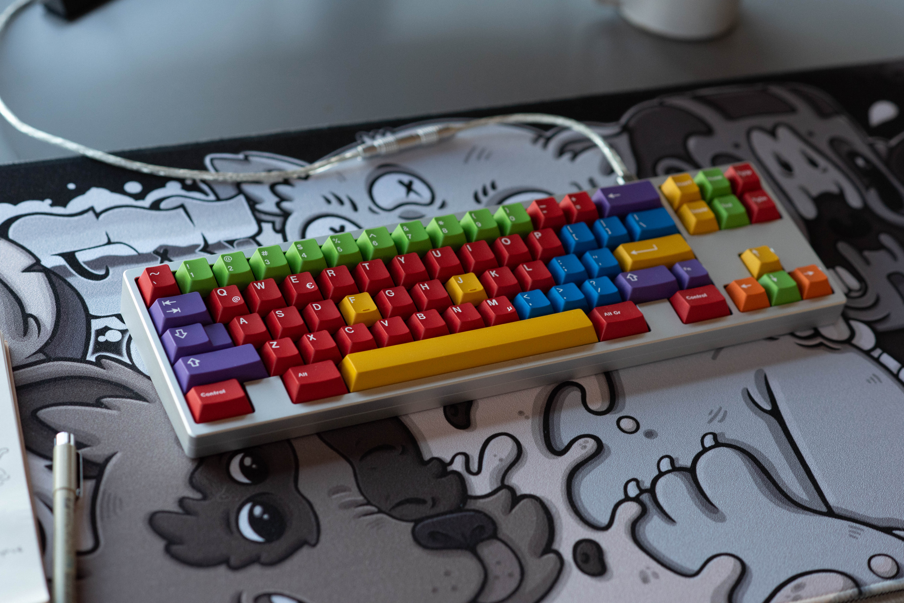
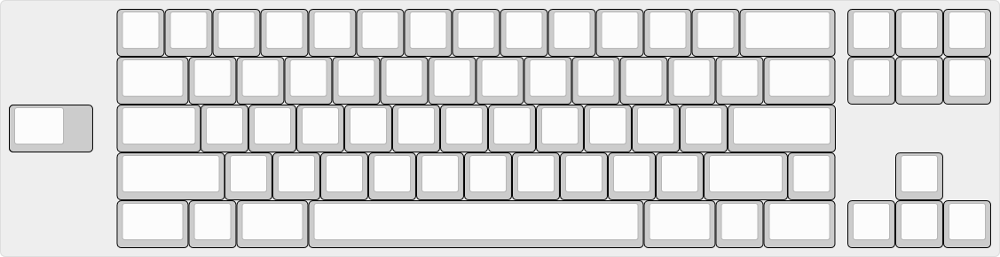
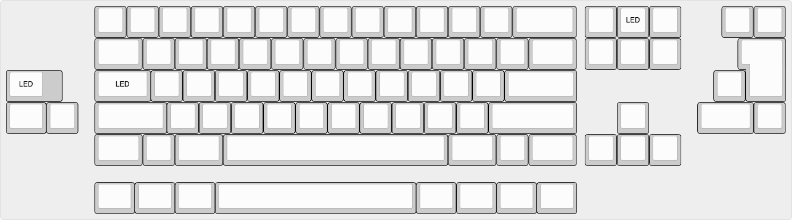
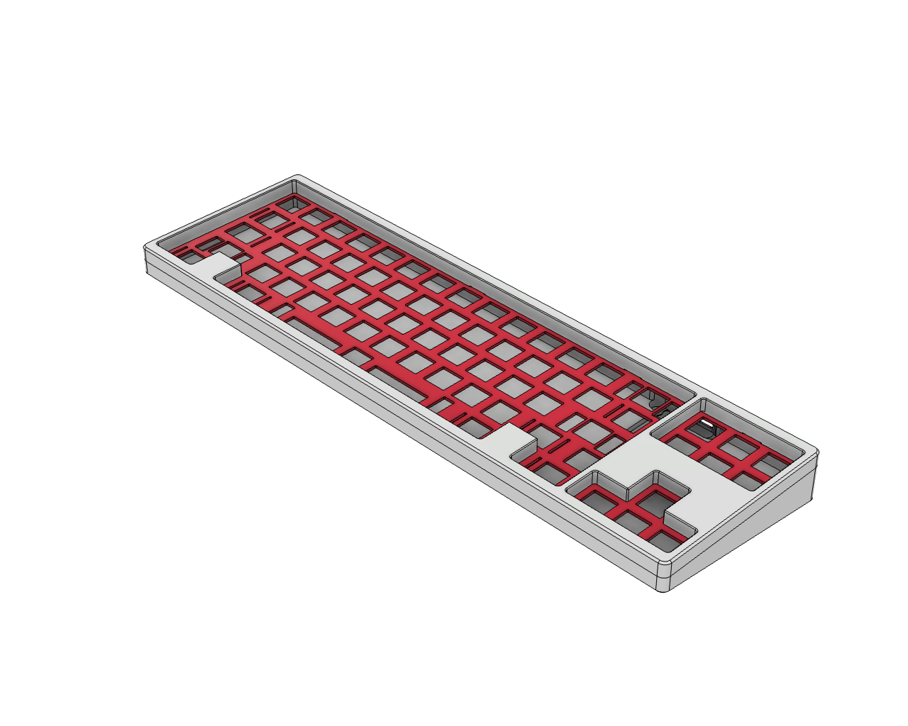
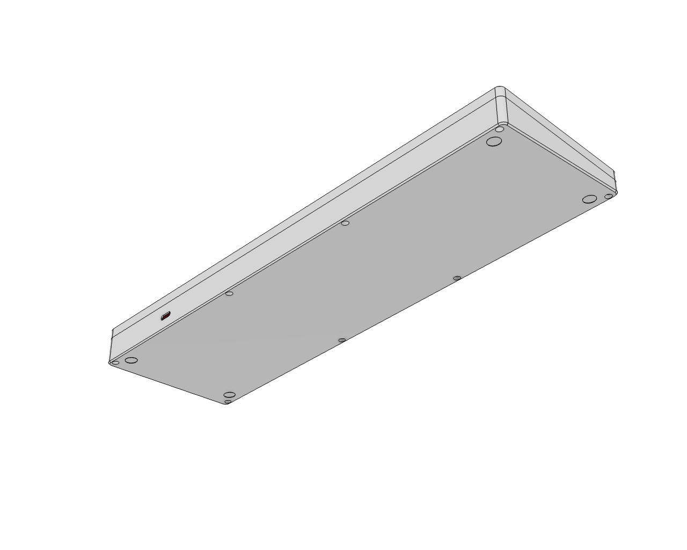
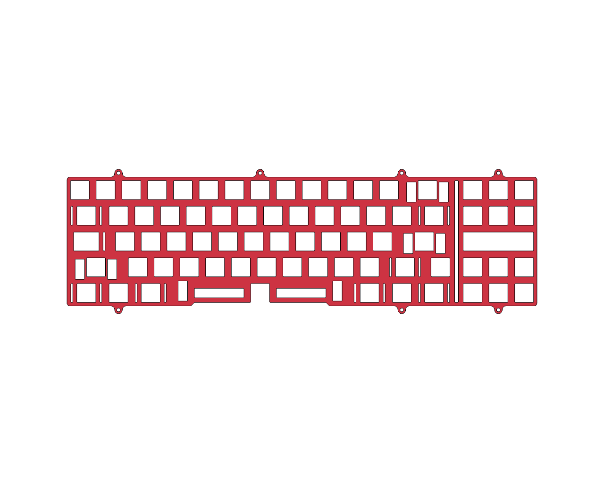
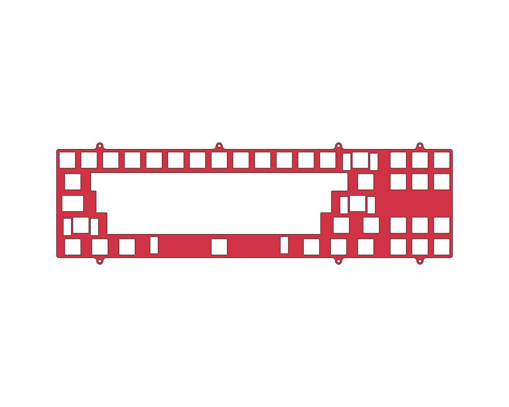

# alex

## specs

### case

- wkl
- top mount
- 6° typing angle
- ≈17.7mm adjusted front height
- seamed
- no weight
- ansi full and half plates

### pcb

- mx
- solder
- molex ezmate connector (support for [s1 unified daughterboard](https://github.com/Unified-Daughterboard/UDB-S))
- stm32f072 mcu
- indicator led support for caps lock and home positions
- qmk and vial firmware
- by [sleepdealer](https://github.com/Sleepdealr/OSFRL)

## plate layout

plate layout support is opinionated and based on personal preference. though the pcb supports alternative layout options ([see below](#pcb-layout)), only files for ansi plates (full and half) in this layout are provided as these are the plates i have prototyped and am happy with.

## pcb layout

## more

