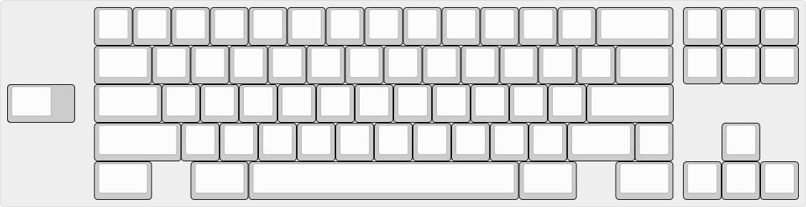

# alex

a top-mount frl with no frills. designed to be easy to manufacture and serve as a prototyped and tested starting point to build on top of.

## Specs

- top mount
- wkl
- 6° typing angle
- ≈17.7mm adjusted front height
- seamed case
- no weight
- full and half plate (ansi)
- pcb by [sleepdealer](https://github.com/Sleepdealr/OSFRL)

## Layout

provided plate layout support is opinionated and based on personal preference; don't like it? make your own. only files for ansi full- and half-plates are provided as these have been tested.
